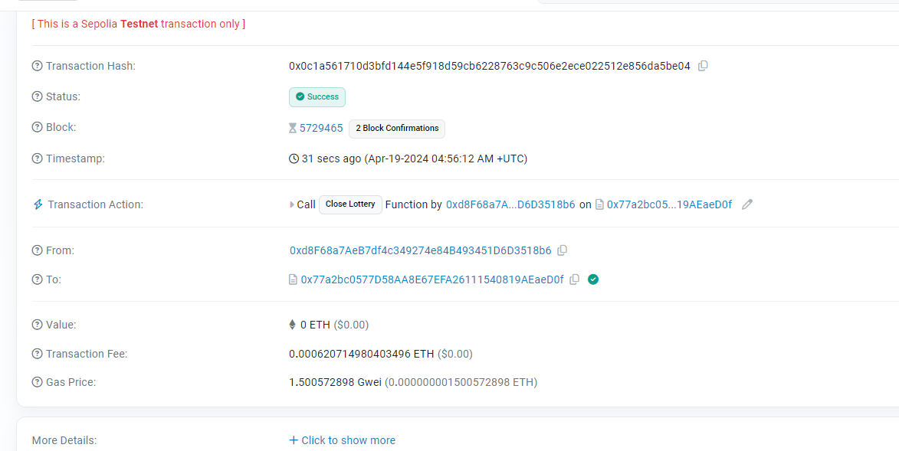

# Lottery


This lottery smart contract allows participants to place bets using a custom token and potentially win prizes. Here's how it works:

1. **Initialization**: The contract is initialized with parameters including the token name, symbol, purchase ratio (tokens given per ETH paid), bet price (tokens required for a bet placed in the prize pool), and bet fee (tokens required for a bet placed in the owner pool).
2. **Betting**: Participants can purchase tokens by sending ETH to the contract. The number of tokens received is calculated based on the purchase ratio.
3. **Opening Bets**: The owner of the contract can open the lottery for receiving bets by specifying a closing time. Once opened, participants can place their bets.
4. **Placing Bets**: Participants place bets by calling the `bet()` function, transferring the required tokens to the contract. A portion of the tokens go to the prize pool, and another portion goes to the owner pool.
5. **Closing the Lottery**: After the specified closing time, anyone can close the lottery by calling the `closeLottery()` function. The contract then selects a winner randomly from the participants and assigns the prize from the prize pool to the winner.
6. **Withdrawing Prizes**: Winners can withdraw their prizes by calling the `prizeWithdraw()` function, which transfers the prize tokens to their account.
7. **Withdrawing Fees**: The owner can withdraw fees collected in the owner pool by calling the `ownerWithdraw()` function.
8. **Returning Tokens**: Participants can return their tokens and receive the equivalent amount of ETH back by calling the `returnTokens()` function.

It's important to note that the randomness source used in this contract is relatively weak since it relies on the previous block's randao value. Additionally, there may be rounding problems in the token calculations.


## Deploy Lottery Contract


[Lottery Token Smart Contact Solidity code ](https://github.com/rchak007/Lottery/blob/main/Backend/contracts/LotteryToken.sol)

[Lottery Token Smart Contact Solidity code](https://github.com/rchak007/Lottery/blob/main/Backend/contracts/Lottery.sol)


### Deploy Script


[Hardhat deploy script](https://github.com/rchak007/Lottery/blob/main/Backend/scripts/deployLottery.ts)


This script is written in TypeScript and utilizes the Hardhat framework for deploying smart contracts. Hardhat is a development environment for Ethereum that helps developers manage and automate the tasks involved in smart contract development.

Here's a summary of what the script does:

1. **Imports**: The script imports necessary modules from Hardhat and other libraries like `viem`, `dotenv`, and `viem/chains`.
2. **Environment Setup**: It sets up environment variables using `dotenv` to load the the Token contract address and API keys necessary for interacting with the Ethereum network.
3. **Contract ABI and Bytecode**: It imports the ABI and bytecode of the smart contracts `LotteryToken.sol` and `Lottery.sol` from their respective JSON files.
4. **Initialization**: The `initContracts()` function is called to deploy the `Lottery` contract and retrieve its address. It also retrieves the address of the token contract associated with the lottery.
5. **Main Function**: The `main()` function sets up a Viem public client and wallet client using the Alchemy API key. It then calls `initContracts()` to deploy the contracts. However, the deployment of the `Lottery` contract is commented out in this script.
6. **Error Handling**: The script catches and logs any errors that occur during execution.

The advantage of using Hardhat for smart contract deployment is that it provides a robust development environment with built-in tasks for compilation, testing, and deployment. It also offers a wide range of plugins and integrations for interacting with Ethereum networks, making the deployment process more streamlined and efficient.


### 

```bash
Backend> npx hardhat run .\scripts\deployLottery.ts               --network sepolia
Lottery address -  0x77a2bc0577d58aa8e67efa26111540819aeaed0f
Token address -  0x1167E1E1df79887d9533019d494504705e5A6FC0
```


### [Lottery Smart contract address](https://sepolia.etherscan.io/address/0x77a2bc0577d58aa8e67efa26111540819aeaed0f)


## Front End 


### UI


### Summary

This frontend code interacts with the deployed lottery smart contract and provides a user interface for participants. 

​	

1. **Imports and Environment Setup**: This section imports necessary modules and components from React, Next.js, Vue, and other libraries. It also sets up environment variables using `dotenv` to load necessary values such as contract addresses.
2. **Home and PageBody Components**: The `Home` component represents the homepage of the application, rendering a welcome message and including the `PageBody` component. The `PageBody` component contains the main content of the page, including components like `WalletInfo` and `RandomWord`.
3. **WalletInfo, WalletAction, and WalletBalance Components**: These components display information about the connected wallet, such as the address, network, and balance. `WalletAction` allows users to test signature functionality, while `WalletBalance` fetches and displays the wallet balance of the connected address.
4. **TokenInfo, Lottery, and Other Lottery Components**: This section provides detailed information about the lottery and token contracts and allows users to interact with them. Components like `TokenInfo` display token information, while `Lottery` displays lottery details and functions. Additional components fetch and display specific lottery information, such as purchase ratio, bet price, and prize pool.
5. **TokenBalance, PurchaseTokens, OpenBets, and OwnerWithdraw Components**: These components facilitate various interactions with the lottery contract, such as checking token balances, purchasing tokens, opening bets, and withdrawing funds. They prepare and execute transactions using hooks like `usePrepareContractWrite` and `useContractWrite`.
6. **PrizeWithdraw, ReturnTokens, BetMany, CloseLottery, and Bet Components**: This section provides additional functionality for the owner and users to interact with the lottery contract. Components like `PrizeWithdraw` allow the owner to withdraw prizes, while `BetMany` allows users to place multiple bets. Some components are commented out as the corresponding functions are not external in the solidity contract.
7. **ApproveTokenTransfer Component**: This component allows the user to approve token transfers for lottery betting by preparing and executing transactions similar to other components.

Overall, these frontend code parts provide a comprehensive user interface for interacting with the deployed lottery smart contract, displaying relevant information, and facilitating various transactions.


### Technical Summary


1. **Component-Based Architecture**: The frontend code follows a component-based architecture, where each UI element or logical unit is encapsulated within its own component. This approach promotes reusability, maintainability, and separation of concerns.
2. **State Management with React Hooks**: React Hooks, such as `useState` and `useEffect`, are extensively used for state management and side effects handling. These hooks allow functional components to manage state and perform side effects without the need for class components.
3. **Interacting with Ethereum Smart Contracts**: The code leverages hooks like `useContractRead`, `usePrepareContractWrite`, and `useContractWrite` to interact with Ethereum smart contracts deployed on the blockchain. These hooks provide convenient abstractions for reading data from contracts, preparing transaction configurations, and executing transactions.
4. **Handling Asynchronous Operations**: Asynchronous operations, such as fetching data from APIs or interacting with smart contracts, are handled using `async/await` syntax or Promise-based approaches. This ensures that the UI remains responsive while waiting for data or transaction confirmation.
5. **Input Validation and Error Handling**: Input validation is performed to ensure that user-provided data is in the expected format and meets certain criteria. Error handling mechanisms, such as `try/catch` blocks, are implemented to gracefully handle exceptions and provide feedback to users in case of invalid input or failed transactions.
6. **Responsive UI Design**: The UI components are designed to be responsive using utility classes like `w-full` and `max-w-xs` from Tailwind CSS. This ensures that the application adapts well to different screen sizes and devices.
7. **Fetching Data from External APIs**: Data fetching from external APIs is implemented using the `fetch` API combined with `async/await` or Promise chaining. This allows the application to retrieve data dynamically and display it to the user without page reloads.
8. **Persisting Data with Local Storage**: Local storage is utilized to persist certain data, such as contract addresses or user preferences, across page reloads. This enhances user experience by preserving state between sessions.
9. **Conditional Rendering**: Conditional rendering techniques are employed to dynamically display or hide UI elements based on certain conditions. This allows for a more personalized and intuitive user interface.

Overall, the frontend code demonstrates modern web development practices, including component-based architecture, state management with hooks, asynchronous programming, responsive design, and data fetching from external sources. These technical approaches contribute to the development of a robust, user-friendly, and interactive web application for interacting with Ethereum smart contracts.


## Demo


### Deployment


```bash
Project5> npx hardhat run .\scripts\deployLottery.ts               --network sepolia
Lottery address -  0x77a2bc0577d58aa8e67efa26111540819aeaed0f
Token address -  0x1167E1E1df79887d9533019d494504705e5A6FC0
```


### Token Purchase & Approval

Account 2 purchases tokens and approves it for Contract.


### Open Bets


#### Closing time set


**deadline in date** - Thu Apr 18 2024 04:06:56 GMT-0700 (Pacific Daylight Time)


### Placing bets


### closeLottery

https://sepolia.etherscan.io/tx/0x0c1a561710d3bfd144e5f918d59cb6228763c9c506e2ece022512e856da5be04





### ownerWithdraw - success


https://sepolia.etherscan.io/tx/0xcd3502850f1bd5a8d9685a973cd0740f8dd188ffbfa3556f1568c5d6b0a88e85


### PrizeWithdraw


https://sepolia.etherscan.io/tx/0x0b1c519dc14f67e6ddf2daed6483220f95166fd7f71d32422d5affca7be935c5


### returnTokens


https://sepolia.etherscan.io/tx/0xdafb8e158170b8464c92d4c1fb95b60145b41b08caae84213f06dc075b62455b


